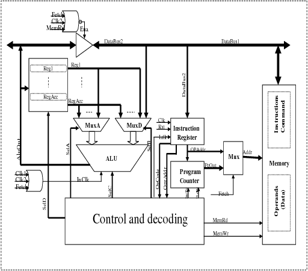
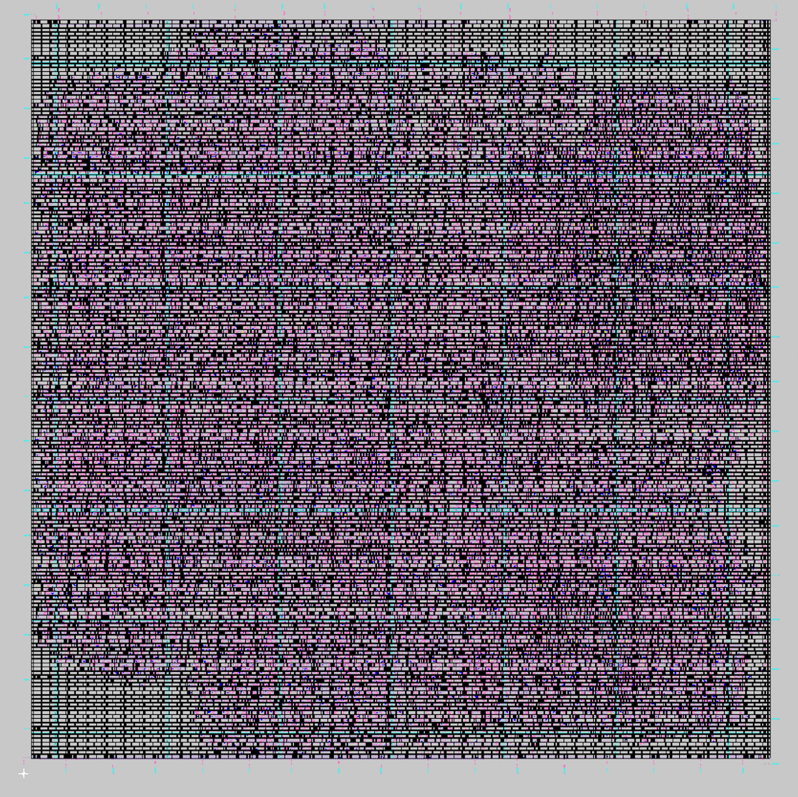

# RISC-V Processor – RTL to GDS

## 📌 Project Overview
This project implements a **RISC-V processor**, starting from **Register Transfer Level (RTL)** design to **GDSII layout generation**. The processor follows the **RISC-V instruction set architecture (ISA)** and includes key components such as the **ALU, register file, instruction memory, data memory, program counter, and control unit**. 

### 🔹 **Key Features**
- ✅ **32-bit RISC-V Processor**
- ✅ Supports **Basic RISC-V Instructions** (ALU Operations, Branching, Memory Access)
- ✅ **Multi-stage Pipeline Design**
- ✅ Implemented in **Verilog HDL**
- ✅ Simulated using **ModelSim / Vivado**
- ✅ Synthesized and PnR using **OpenROAD**
- ✅ Layout Verification with **DRC & LVS**

---

## 🏗 **Project Structure**
```
RISC-V_Processor/
│── src/                    # Source Code
│   │── cpu.v               # CPU top module
│   │── alu.v               # Arithmetic Logic Unit (ALU)
│   │── register_file.v      # Register File
│   │── instruction_memory.v # Instruction Memory
│   │── data_memory.v        # Data Memory
│   │── program_counter.v    # Program Counter
│── testbench/               # Testbenches
│   │── cpu_tb.v             # Testbench for CPU
│── synth/                   # Synthesis Reports
│── layout/                  # Floorplanning & Layout Images
│── waveforms/               # Simulation Waveform Images
│── README.md                # Project Documentation
│── Makefile                 # Automation for Compilation & Simulation
```

---

## ⚙️ **Setup & Installation**
### **🔹 Prerequisites**
Ensure you have the following installed:
- **Verilog Simulator**: ModelSim / Vivado / Icarus Verilog
- **Synthesis & PnR**: Yosys, OpenROAD, Magic VLSI
- **Waveform Viewer**: GTKWave

### **🔹 Steps to Run the Simulation**
1. **Clone the repository**  
   ```bash
   git clone https://github.com/yourusername/RISC-V_Processor.git
   cd RISC-V_Processor
   ```
2. **Run the Verilog simulation**  
   ```bash
   iverilog -o cpu_tb testbench/cpu_tb.v src/*.v
   vvp cpu_tb
   gtkwave waveforms/cpu_tb.vcd
   ```
3. **Synthesize using Yosys**  
   ```bash
   yosys -s synth/synthesis.ys
   ```
4. **Run Place & Route (PnR)**  
   ```bash
   openroad -script layout/place_route.tcl
   ```
5. **View Layout in Magic**  
   ```bash
   magic -T layout/design.mag
   ```

---

## 📸 Project Images

### 🔹 Waveform Simulation


### 🔹 Computer Architecture


### 🔹 Final Layout


---

## 🚀 **Future Enhancements**
- Implementing **pipeline stages** for improved performance.
- Supporting **additional RISC-V instructions**.
- Optimizing for **lower power & area efficiency**.
- Running on an **FPGA board**.
